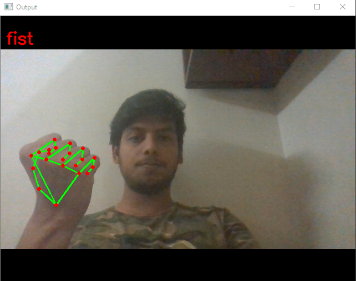

# i-Speak-Gesture-Detection
Gesture recognition is an active research field in Human-Computer Interaction technology. It has many applications in virtual environment control and sign language translation, robot control, or music creation. In this machine learning project on Hand Gesture Recognition, we are going to make a real-time Hand Gesture Recognizer using the MediaPipe framework and Tensorflow in OpenCV and Python.
OpenCV is a real-time Computer vision and image-processing framework built on C/C++. But we’ll use it on python via the OpenCV-python package.

# What is MediaPipe?
MediaPipe is a customizable machine learning solutions framework developed by Google. It is an open-source and cross-platform framework, and it is very lightweight. MediaPipe comes with some pre-trained ML solutions such as face detection, pose estimation, hand recognition, object detection, etc.

# What is Tensorflow?
TensorFlow is an open-source library for machine learning and deep learning developed by the Google brains team. It can be used across a range of tasks but has a particular focus on deep neural networks.

<B>Neural Networks</B> are also known as artificial neural networks. It is a subset of machine learning and the heart of deep learning algorithms. The concept of Neural networks is inspired by the human brain. It mimics the way that biological neurons send signals to one another. Neural networks are composed of node layers, containing an input layer, one or more hidden layers, and an output layer.
<Br>
  <Br>
    <Br>

<Br>
  <Br>
    <Br>
We’ll first use MediaPipe to recognize the hand and the hand key points. MediaPipe returns a total of 21 key points for each detected hand.
<br>
      <Br>
        <Br>

<Br>
  <Br>
    <Br>
These key points will be fed into a pre-trained gesture recognizer network to recognize the hand pose.

# Prerequisites for this project:
1. Python – 3.x (we used Python 3.8.8 in this project)<Br>

2. OpenCV – 4.5<Br>
Run ```pip install opencv-python``` to install OpenCV.

3. MediaPipe – 0.8.5<Br>
Run ```pip install mediapipe``` to install MediaPipe.

4. Tensorflow – 2.5.0 <Br>
Run ```pip install tensorflow``` to install the tensorflow module.

5. Numpy – 1.19.3

# Outputs

<br>
<br>
<br>
      

        <Br>
        <br>
        <br>
      
          <Br>
        <br>
        <br>
      
            <Br>
        <br>
        <br>
      
              <Br>
        <br>
        <br>
      
                <Br>
        <br>
        <br>
      
